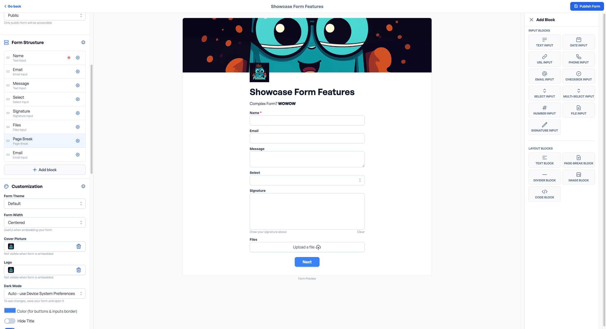

# Blocks

Blocks are the building blocks of a form. They are the individual elements that make up a form. Blocks can be added,
removed, and rearranged to create a form. Blocks can be added to a form by selecting them from the drawer on the right.

## Input Blocks

Input blocks are the most common type of block. They are used to collect information from the user.

### Text Input

Text input is the most common type of input. It is used to collect short text from the user.

### Date Input

Date input is used to collect a date from the user.

### URL Input

URL input is used to collect a URL from the user.

### Phone Input

Phone input is used to collect a phone number from the user.

### Email Input

Email input is used to collect an email address from the user.

### Checkbox Input

Checkbox input is used to collect a boolean value from the user.

### Select Input

Select input is used to collect a single value from a list of options.

### Multi-Select Input

Multi-select input is the same as Select Input but allows the user to select multiple options.

### Number Input

Number input is used to collect a number from the user.

### File Input

File input is used to collect a file from the user.

### Signature Input

Signature input is used to collect a signature from the user. The user must draw it using the canvas.

## Layout Blocks

Layout blocks are used to organize the form and make it more readable.

### Text Block

Text block is used to display text on the form.

### Page-Break Block

Page-break block is used to split the form into multiple pages. Read more about [Multistep Forms](../features/mutli-step-form.md).

### Divider Block

Divider block is used to separate different sections of the form. Increase the readability of the form.

### Image Block

Image block is used to display an image on the form.

### Code Block

Code block is used to display code on the form. Can display HTML and CSS. We recommend using it for CSS only.
To write CSS, you must wrap your code in `<style>` tags.
