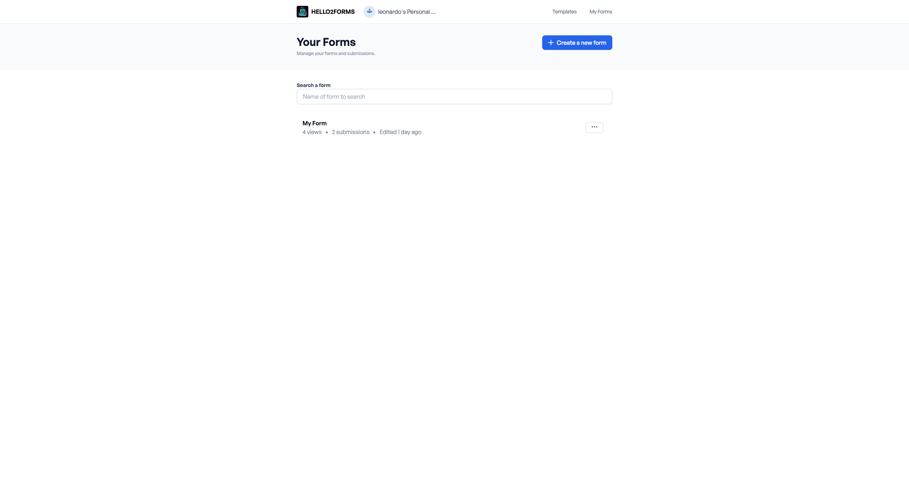

# Create a form

Hello2Forms provides an intuitive interface for creating forms. Whether you need simple contact forms, surveys, or complex registration forms, Hello2Forms has you covered.

## Create a New Form

To create a new form, follow these steps:

1. On the first page of the Hello2Forms admin interface, click the **Create a new form** button.
2. Then you will be redirected to the form builder page.
3. From here you can hit the Publish button to publish the form, but probably you want to add some fields first. Please refer to the [Form Builder Overview](/features/form-builder-overview.md) to learn all superpowers we offer.

