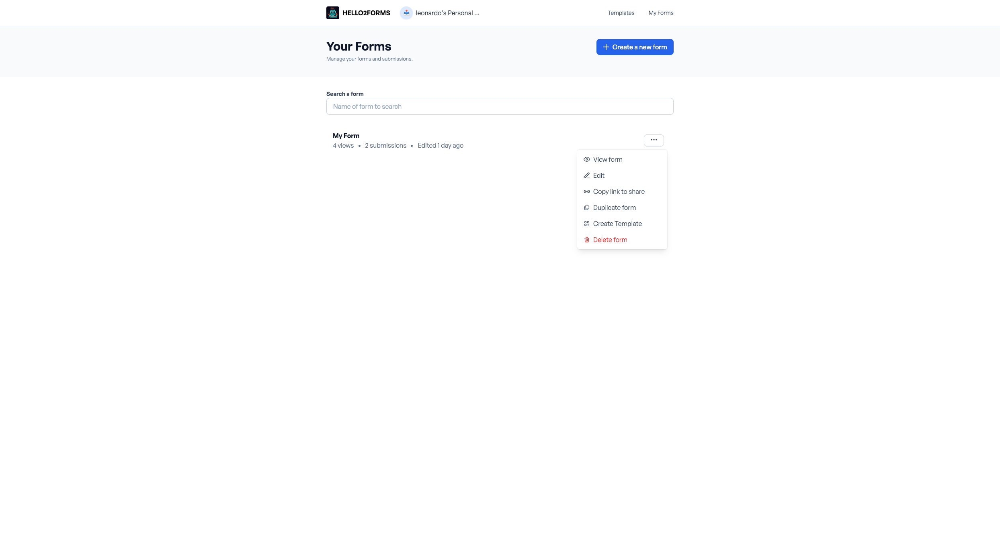

# Form Actions

When it comes to forms, there are a few actions that can be performed. These actions are:

## Create

Creating a new form is the first step to start using the form builder. You can create a new form by clicking on the "
Create a new form" button in the dashboard.

## Duplicate

Duplicate a form to create a new form with the same structure. It's useful when you want to create a similar form to an
existing one.
You can duplicate a form by clicking the three dots near on the form you want tot duplicate and then hit the "Duplicate"
button in dashboard.

## Delete

Delete a form to remove it from the dashboard. It's useful when you want to remove a form that you don't need anymore.
You can delete a form by clicking the three dots near on the form you want tot delete and then hit the "Delete" button.

## Share
Share a form to allow others to access it. It's useful when you want to share a form with others.
You can learn more about sharing a form [here](../features/share.md).
