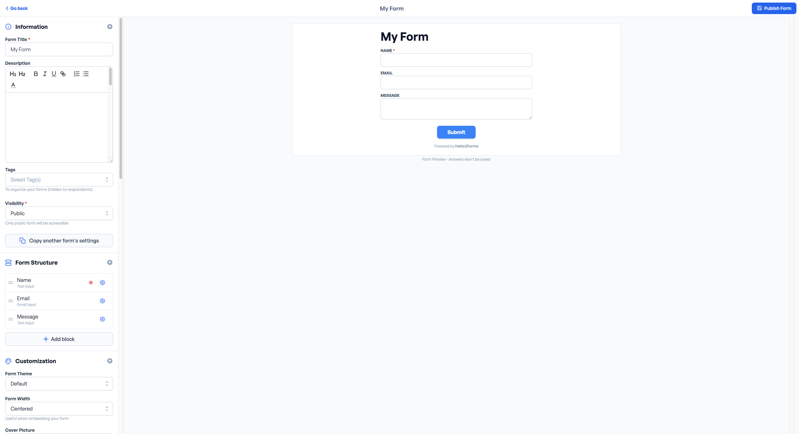
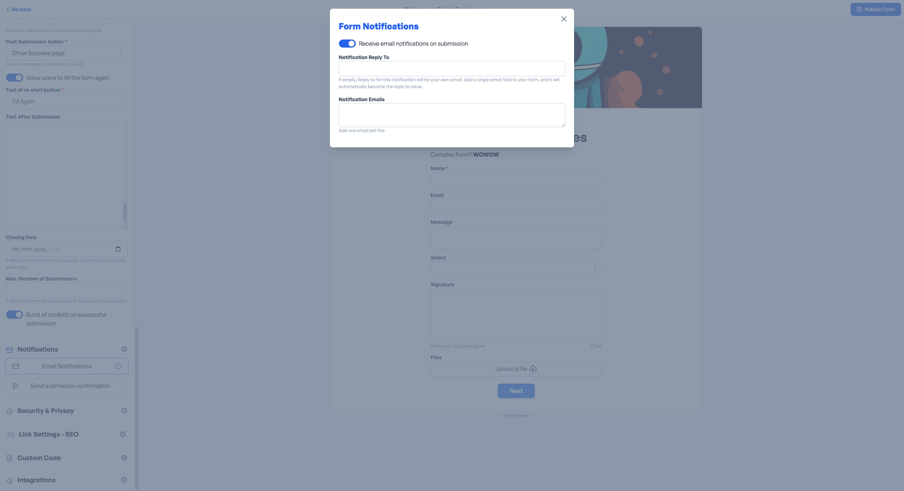
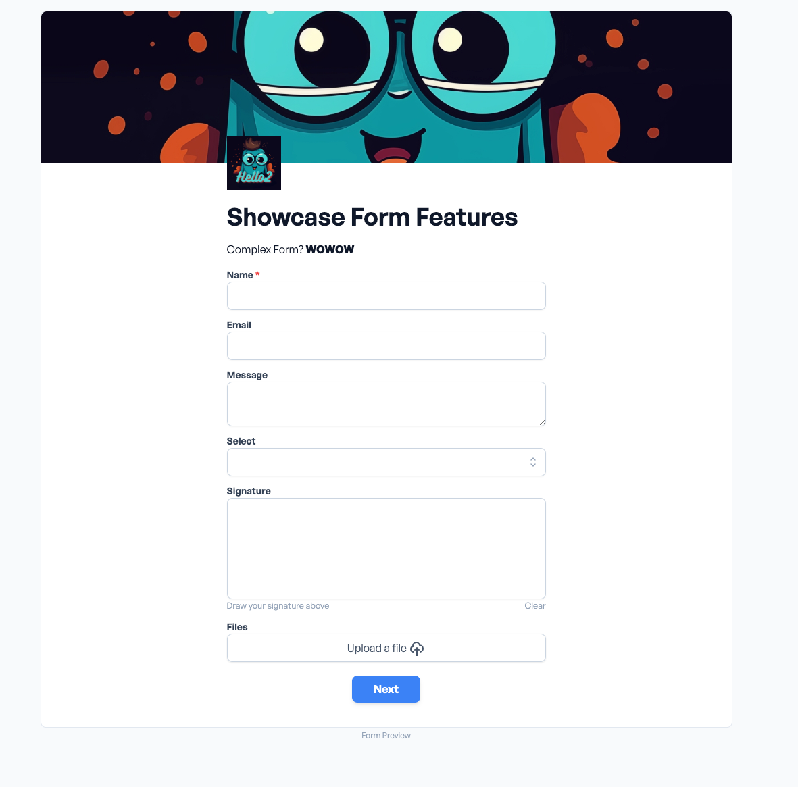

# Form Builder Overview

## Information

### Form Title

Form title is the name of the form. It is displayed on the form builder page and on the form preview page. It's also
used to generate the slug. It Can be hidden later on, when sharing the form or directly from the settings.

### Description

The description is displayed on the form builder page and on the form preview page. It supports rich text, so you can
customize it as you want.

### Tags

Tags are used to categorize forms and templates. You can add multiple tags to a form.
They are not displayed to the end user, just to you.

### Visibility

Handle the visibility of the form. You can choose between public, closed and draft.

- Public forms are accessible by anyone
- Draft forms are not accessible by anyone
- Closed forms are accessible by anyone but they do not accept submissions.

### Copy Another Form

It copies the structure of another form. It's useful when you want to create a similar form to an existing one.

## Form Structure

## Blocks

## Customization

### Form Theme

Form theme is used to customize the look and feel of the form. You can choose between different simple, notion and
default.

### Form Width

Form width is used to set the width of the form. You can choose between different Centered and Full Width.

### Cover Picture

Set a cover picture for the form. It's displayed on the form page.

### Logo

Set a logo for the form. It's displayed on the form page as somewhat of an user avatar.

### Dark Mode

Enable dark mode for the form. It's useful when you want to have a dark theme for the form.

### Color

Primary color is used to set the color of the form. It's used for buttons, links and other elements.

### Hide Title

Hides the title of the form.

### Remove Branding

Removes the branding from the form.

### Uppercase Input Labels

Transforms the input labels to uppercase. The texts above the inputs.

### Transparent Background

Sets the background of the form to transparent.

## About Submissions

### Text Of Submit Button

The text of the submit button is used to customize the text of the submit button.

### Editable submissions

Allow users to edit their submissions after they have been submitted.

### Text of editable submission button

Only available if you allow editable submissions.
The text of the editable submission button is used to customize the text of the editable submission button.

### Post Submission Actions

## Notifications

Send an email notification to the user when the form is submitted. You can customize the email in the popup.
You can also set to receive an email notification when the form is submitted by someone else.

## Security & Privacy

Choose between different security and privacy settings. Hide the form from Google Search, protect the form with hCaptcha
or add a password to the form.

## Link Settings - SEO

Customize the link when sharing the link to your form on social media or other platforms. Add a title, description and
image.

## Custom Code

Custom code is used to add custom code to the form. You can add custom CSS, custom JavaScript and custom HTML.

## Integrations

### Webhooks

Add a webhook to the form. It's useful when you want to send the form data to another service.

By the end of this list, your form could look like this:

