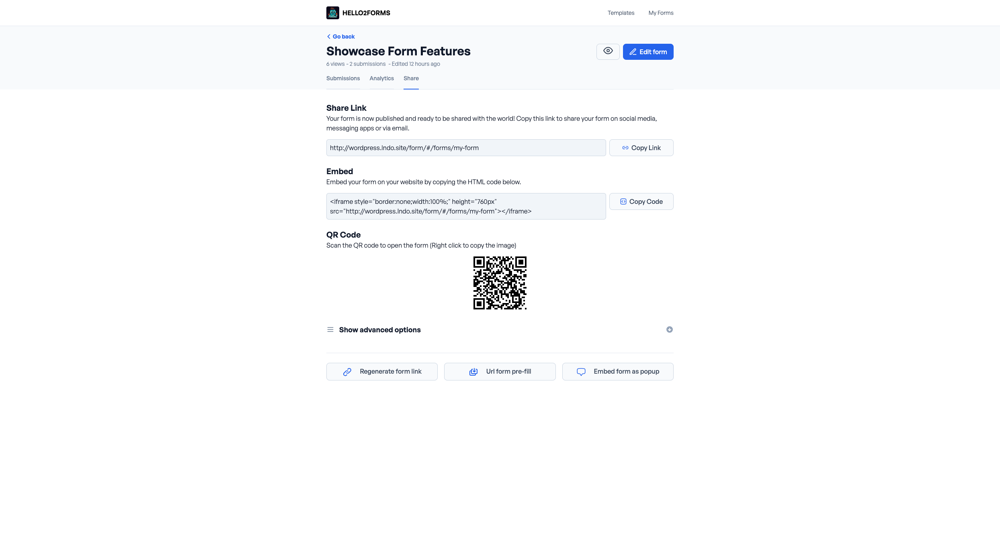
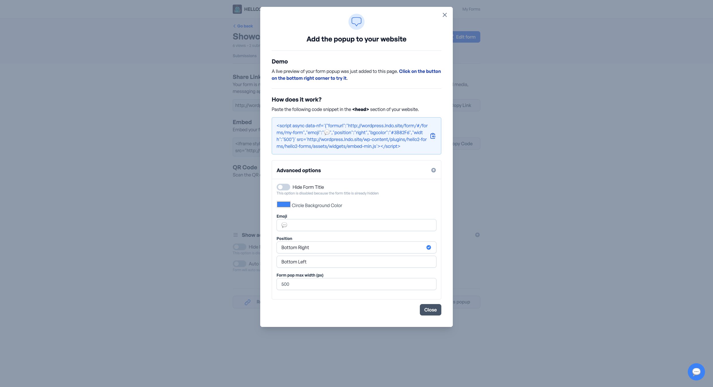
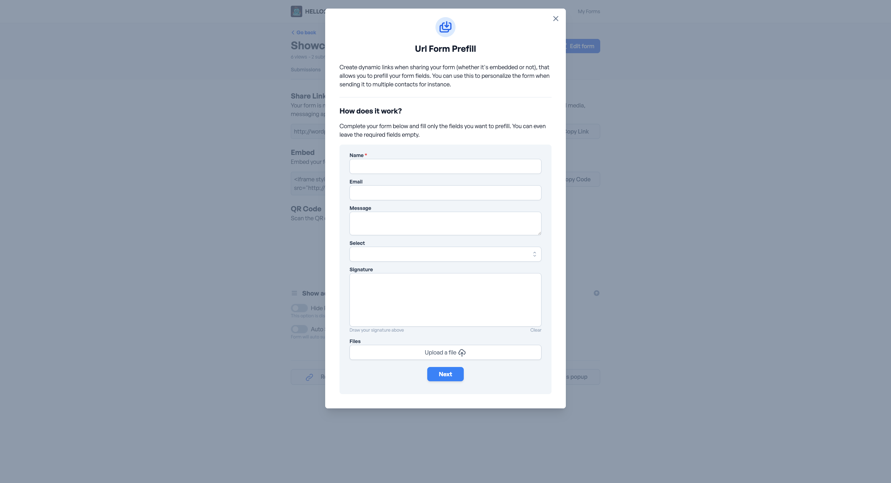
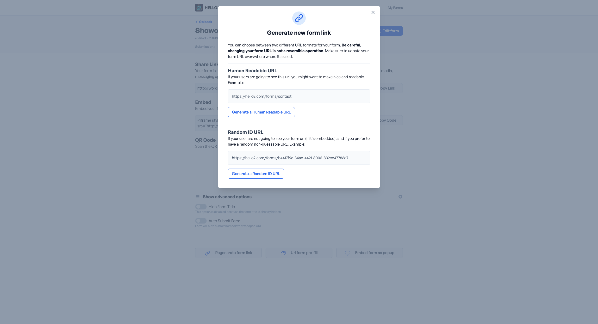

# Sharing Forms

## Sharing Options

### Share Link

You can share a form by copying the share link and sending it to others. The share link can be found in the form settings.

### Embed

You can embed a form on your website by copying the embed code and pasting it into your website's HTML.

### QR Code

You can share a form by displaying the QR code and allowing others to scan it with their mobile device.

### Embed as Popup

You can embed a form as a popup on your website by copying the embed code and pasting it into your website's HTML.

### Options

Each sharing option has additional settings:
- **Hide Form Title**: Hide the form title when sharing the form.
- **Auto Submit**: Automatically submit the form when it's loaded.
- **Url Form Pre-Fill**: Pre-fill the form with the URL parameters.

## Extra settings on share page

## Regenerate Form Link

After clicking on the "Regenerate Form Link" button, a pop-up will appear giving you two options:
- **Human Readable Url**: This will generate a new human-readable URL for your form.
- **Random ID Url**: This will generate a new random uuId for your form.

