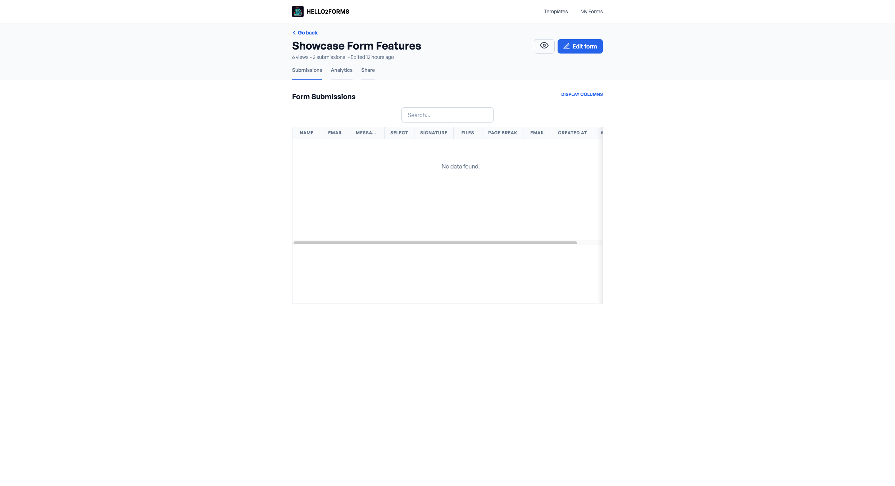

# Submissions

After a form is submitted, the data is stored in the Submissions section of each form. You can view, delete, and export
the submissions.

## View Submissions

To view the submissions, click on any form, and the first page will be the submission tab. Here you will see a table
with a column for each field.

Submissions can only be deleted from this page.

You can export all submissions for a table in CSV format by clicking the "Export" button.

