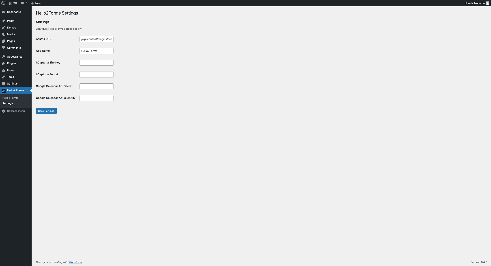

# Configuration

## Settings

1. Navigate to **Hello2Forms > Settings** from the left-hand menu.
2. In the **Settings** tab, you can configure the following settings:
   - **Assets URL**: The URL to the assets folder. This is used to load the CSS and JavaScript files. Usually set to `/wp-content/plugins/hello2-forms/assets/` (this option will be removed soon)
   - **App Name**: The name of the application. This is used to whitelabel your forms and emails.
   - **hCAPTCHA Site Key**: The site key for hCAPTCHA. This is used to protect your forms from spam. (Check Below on how to configure)
   - **hCAPTCHA Secret Key**: The secret key for hCAPTCHA. This is used to protect your forms from spam. (Check Below on how to configure)

## hCaptcha Integration

1. To use hCAPTCHA, you need to [sign up](https://www.hcaptcha.com/) for an account.
2. Once you have an account, you can obtain the site key and secret key from the [dashboard](https://dashboard.hcaptcha.com/).
3. Enter the site key and secret key in the **Settings** tab under **Hello2Forms > Settings**.
4. Save the settings.
5. You can now use hCAPTCHA to protect your forms from spam.

## Google Calendar Integration

Check the [Google Meet/Calendar Integration](../integrations/google.md) documentation for more information on how to integrate Google Calendar with Hello2Forms.

